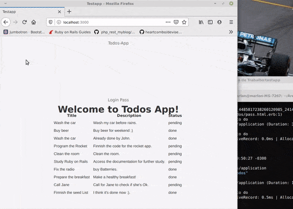

<div align="center">
  <a href="https://rubyonrails.org">
    
  </a>
</div>

# Single Authentication page for Devise - PassToDo

## Use case scenario for single page authentication using Devise.



# Direct on point

This repository is one scaffolded template who uses one custom partial/page, instead of Devise generated views

## For what reason?

It brings to developer the freedom to fully customize your Rails authentication 
view without worry about devise views or flash messages.

# What's the "trick" ? 

In addition with customize the authentication partials, you need override the create action on registrations_controller.rb and the new action on sessions_controller.rb files.

Click in the link to learn [How To: Display a custom sign_in form anywhere in your app](https://github.com/heartcombo/devise/wiki/How-To:-Display-a-custom-sign_in-form-anywhere-in-your-app)

and then add the following code snippets for:
```app/controllers/user/registrations_controller.rb```
```ruby
  def create
    build_resource(sign_up_params)

    resource.save
    yield resource if block_given?
    if resource.persisted?
      if resource.active_for_authentication?
        set_flash_message! :notice, :signed_up
        sign_up(resource_name, resource)
        respond_with resource, location: after_sign_up_path_for(resource)
      else
        set_flash_message! :notice, :"signed_up_but_#{resource.inactive_message}"
        expire_data_after_sign_in!
        respond_with resource, location: after_inactive_sign_up_path_for(resource)
      end
    else
      clean_up_passwords resource
      set_minimum_password_length
      #respond_with resource      # DEFAULT
      #redirect_to pass_path      # Redirect without messages
      #render "pass"              # Require create path: views/user/registrations/pass.html.erb
      render :template => 'todos/pass'
    end
  end
```
and for:
``` app/controllers/user/sessions_controller.rb```
```ruby
  def new
    self.resource = resource_class.new(sign_in_params)
    clean_up_passwords(resource)
    yield resource if block_given?
    #respond_with(resource, serialize_options(resource))
    render :template => 'todos/pass'
  end
```
The following link is my gotcha to make it: [Devise: redirect on sign up failure?](https://stackoverflow.com/questions/6240141/devise-redirect-on-sign-up-failure)

And that's it !

# IMPORTANT: What versions i'm using

I think older versions will be run fine, but for information purposes, 
that's my current versions of:

```ruby '2.7.0'```

```gem 'rails', '~> 6.0.3', '>= 6.0.3.2'```

```gem 'devise', '~> 4.7', '>= 4.7.2'```

```gem 'rails', '~> 6.0.3', '>= 6.0.3.2'```

# How do you run the code:

Considering that you know how to clone a repository and have Ruby installed on your "machine",
Simply clone or fork the repo, and then run

```bin/yarn ```

```rails db:seed```

```rails assets:precompile``` | Optional

```rails s ```

And open http://localhost:3000 on any browser.

All users like john@gmail.com have password 123123 to easy handling purposes.


**Note:** It's necessary override Devise's custom controllers, so be alert in 
case of breaking changes about this gem.

# Further Actions

You can freely use this repo to-do (Ha!) anything you want like tests coverage,
crossed authorization prevention(done), add username parameter for Devise
or make one prettier stylesheet...

It will be updated in the future. Maybe....